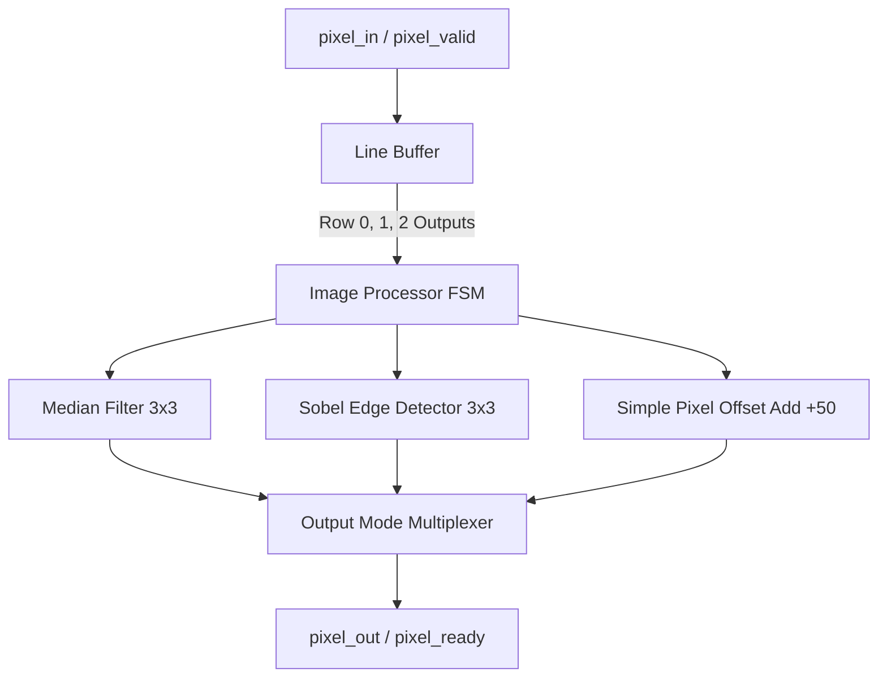

# VHDL Image Processor

A hardware-accelerated image processing system designed in VHDL. The project implements a pipeline for real-time 2D spatial filtering and pixel manipulation operations on streaming image data.

---

## Project Overview & Goals

This project provides a hardware-based implementation of image processing algorithms, optimized for FPGA/ASIC deployment. The system is designed to process an incoming pixel stream and apply various spatial filters using a sliding 3x3 window.

Key capabilities and goals of the design:
- **Streaming Architecture:** Processes pixels on-the-fly with handshake signals (`pixel_valid` and `pixel_ready`).
- **Line Buffering:** Dynamically buffers image rows to construct 3x3 pixel neighborhoods without requiring full-frame memory storage.
- **Filtering Operations:**
  - **Median Filtering:** Performs 3x3 median sorting to eliminate impulse (salt-and-pepper) noise.
  - **Sobel Edge Detection:** Computes horizontal and vertical gradients to locate boundaries/edges in an image.
  - **Pixel Modification:** Applies point operations (e.g., contrast adjustment or offset additions).

---

## Hardware Architecture



1. **Pixel Input:** Pixels are streamed in sequentially accompanied by a `pixel_valid` strobe.
2. **Line Buffering:** A sliding 3x3 window is maintained using line buffers to delay rows of pixels.
3. **Processing Modules:** Sub-modules calculate filtered outputs concurrently.
4. **Multiplexer & Control:** The top-level entity selects the active processing mode and controls output timing.

---

## File Structure & Descriptions

Below is an overview of the files making up this project:

| File Name / Path | Language / Type | Description |
| :--- | :--- | :--- |
| **`src/image_processor.vhd`** | VHDL (Source) | The top-level entity (`fixed_image_processor`). It manages the handshaking interface, internal line buffer logic, state tracking, and output multiplexing. |
| **`src/line_buffer.vhd`** | VHDL (Source) | A generic line buffer module that stores 3 consecutive rows of pixel data to construct a 3x3 local neighborhood. |
| **`src/sobel_edge.vhd`** | VHDL (Source) | Implements the 3x3 Sobel filter. Approximates gradient magnitude as $|G_x| + |G_y|$ and clamps values to the maximum pixel limit. |
| **`src/median_filter.vhd`** | VHDL (Source) | Implements a 3x3 median filter using a pipelined bubble-sort algorithm to find the median value of 9 pixels. |
| **`tb/image_processor_tb.vhd`** | VHDL (Testbench) | The testbench architecture (`working_tb`) that generates clock/reset stimuli, inputs a 4x4 test pattern, and monitors outputs. |
| **`scripts/generate_test_image.py`** | Python | A helper script to generate standard 640x480 gray-scale gradient images for system testing. |
| **`build.sh`** | Bash Script | Shell script to automate the GHDL simulation pipeline: clean work files, compile, elaborate, run the simulation, and launch GTKWave. |
| **`waveform.gtkw`** | GTKWave Config | Saved signals configuration for GTKWave, enabling quick viewing of relevant simulation waveforms. |

---

## Simulation & Build Guide

### Prerequisites

To compile and run the simulations, you need:
- **GHDL** (VHDL analyzer, compiler, and simulator)
- **GTKWave** (Waveform visualizer)
- **Python 3** (with `numpy` and `pillow` libraries for generating test images)

### Running Simulation

You can run the entire compilation, simulation, and visualization pipeline using the provided shell script:

```bash
chmod +x build.sh
./build.sh
```

This script will:
1. Clean old work files and waveform outputs.
2. Compile VHDL files inside `src/` and `tb/` into the `work/` library.
3. Elaborate the testbench module (`working_tb`).
4. Run the simulation and dump waveform details into `waveform.fst`.
5. Open the `waveform.fst` file in **GTKWave** using the pre-configured layout in `waveform.gtkw`.

### Generating Test Images

To generate test raw files and PNG previews:

```bash
python3 scripts/generate_test_image.py
```

This creates:
- `test_image.raw`: Raw byte values of a $640 \times 480$ grayscale horizontal gradient.
- `test_image.png`: A PNG version of the gradient for manual visual inspection.